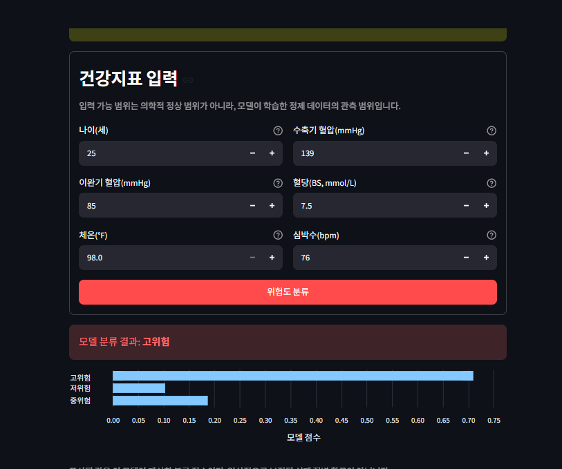

# 임산부 건강 위험도 분류 프로젝트

UCI의 `Maternal Health Risk` 데이터를 수집·검증·전처리하고, 세 가지 머신러닝 모델을
동일한 기준으로 비교한 뒤 최종 모델을 Streamlit 웹 화면에서 실행하는 프로젝트입니다.

> 이 결과물은 교육·연구용입니다. 의료기기가 아니며 실제 진단·응급 판단·치료 결정에
> 사용할 수 없습니다.

## 실행 화면



`models/best_model.joblib`은 학습된 Random Forest를 저장한 이진 파일이므로 GitHub에서
사진이나 코드처럼 미리 볼 수 없습니다. 위 화면은 `app.py`가 해당 모델을 불러와 실제로
예측을 수행한 결과입니다.

## 포함된 기능

- 공식 UCI ZIP 다운로드 및 SHA-256 무결성 검증
- 열 구조·자료형·결측치·중복·위험단계 자동 검사
- 완전 동일 중복 제거와 심박수 7 bpm 값 보정
- Logistic Regression, Decision Tree, Random Forest 비교
- 학습 세트 내부 5겹 층화 교차검증 `macro F1`로 최종 모델 선택
- 한 번 분리한 20% 홀드아웃으로 정확도, balanced accuracy, macro F1 및 단계별 성능 평가
- 모델·메타데이터·예측 결과·혼동행렬·그래프 자동 저장
- 6개 지표를 입력하는 Streamlit 분류 데모

## 바로 실행하기

### Windows

압축을 푼 뒤 `run_windows.bat`를 더블클릭합니다. 처음 실행할 때 필요한 패키지를 설치한
후 웹 브라우저가 열립니다.

### macOS / Linux

```bash
chmod +x run_unix.sh
./run_unix.sh
```

### 명령어로 실행

```bash
python -m venv .venv
# Windows: .venv\Scripts\activate
# macOS/Linux: source .venv/bin/activate
python -m pip install -r requirements.txt
python run_pipeline.py
python -m streamlit run app.py
```

학습된 모델과 실행 결과가 이미 포함되어 있으므로, 웹앱만 실행할 때는 마지막 명령만
사용해도 됩니다. 원본을 다시 받을 때는 `python scripts/download_data.py --force`를 실행합니다.

## 실제 데이터 점검 기준

- UCI 페이지에는 1,013개 인스턴스로 표기되어 있지만 현재 공식 CSV에는 1,014개 데이터
  행이 있습니다. 본 프로젝트는 실제 파일 감사 결과를 그대로 기록합니다.
- 공식 CSV에는 완전히 동일한 행 562개가 있습니다. 개인 식별자·측정 시점이 없어 반복
  측정인지 단순 복제인지 확인할 수 없으므로, 동일 행이 학습·시험 세트에 동시에 들어가는
  누수를 막기 위해 분할 전에 제거합니다. 이 선택은 `preprocessing_audit.json`에 남습니다.
- 원본의 심박수 7 bpm 두 건은 같은 행입니다. 중복 제거 후 남은 한 건을 Togunwa 등(2023)이
  같은 데이터에서 사용한 처리에 따라 최빈값 70 bpm으로 보정합니다.

## 평가 원칙

정확도만으로 모델을 선택하지 않습니다. 세 위험단계의 표본 수가 다르므로, 각 단계를 같은
비중으로 반영하는 `macro F1`을 모델 선택 기준으로 사용합니다. 최종 홀드아웃은 모델 선택에
사용하지 않고 마지막 평가에만 사용합니다. 실제 실행 수치는 [reports/RESULTS.md](reports/RESULTS.md),
세부 CSV·JSON은 `reports/metrics/`에서 확인할 수 있습니다.

## 폴더 구성

```text
app.py                      Streamlit 웹앱
run_pipeline.py             전처리·학습·평가 전체 실행
scripts/download_data.py    공식 데이터 재다운로드
src/                        데이터·모델·보고서 코드
data/raw/                   검증된 UCI 원본 CSV
data/processed/             전처리된 CSV
models/                     최종 모델과 메타데이터
reports/                    실제 성능표와 그래프
tests/                      데이터·모델 자동 테스트
```

## 근거 자료

- UCI Machine Learning Repository, *Maternal Health Risk*: https://archive.ics.uci.edu/dataset/863/maternal%2Bhealth%2Brisk
- 데이터 DOI: https://doi.org/10.24432/C5DP5D
- Togunwa et al. (2023), *Interpretable machine learning for personalized medical recommendations: a case study in pregnancy care*: https://doi.org/10.3389/frai.2023.1213436
- scikit-learn, Model evaluation: https://scikit-learn.org/stable/modules/model_evaluation.html
- scikit-learn, Cross-validation: https://scikit-learn.org/stable/modules/cross_validation.html
- scikit-learn, Pipeline: https://scikit-learn.org/stable/modules/generated/sklearn.pipeline.Pipeline.html
- Streamlit documentation: https://docs.streamlit.io/
